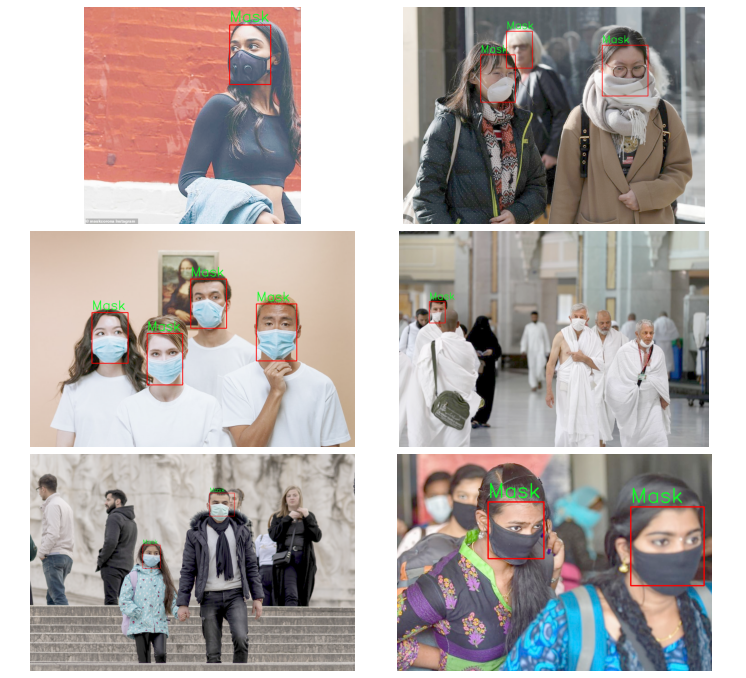
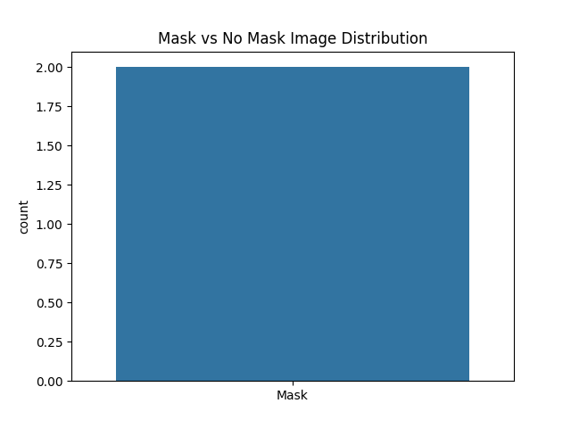

# 😷 Face Mask Detection using OpenCV and CNN

This project detects whether a person is wearing a face mask in images using OpenCV's deep learning-based face detector and a Convolutional Neural Network (CNN) built with TensorFlow/Keras.

---

## 📌 Features

* 🔍 Face detection using OpenCV’s `dnn` module (Caffe-based model)
* 🧠 Custom CNN trained to classify faces as:

  * **Mask**
  * **No Mask**
* 📈 Real-time prediction on test images
* 📊 Dataset analysis and distribution visualization
* ✅ Clean preprocessing pipeline with bounding box cropping and augmentation

---

## 🖼 Example Output



---

## 📁 Project Structure

```
face-detection/
├── Medical Mask/              # Images and annotations
├── models/                    # Pre-trained face detector (Caffe)
├── train.csv, submission.csv  # Training and evaluation data
├── main.py                    # Main training & prediction script
├── Figure_1.png               # Mask vs No Mask distribution
├── Figure_2.png               # Sample detection results
```

---

## 🚀 Getting Started

### 1. Install dependencies

```bash
pip install numpy pandas matplotlib seaborn opencv-python scikit-learn tensorflow
```

### 2. Download Caffe model files (if not already present)

```python
# auto-download helper is in main.py or provided separately
```

### 3. Run the script

```bash
python main.py
```

---

## ✅ Output Samples

* **Mask vs No Mask distribution:**



* **Detection results with bounding boxes:**


